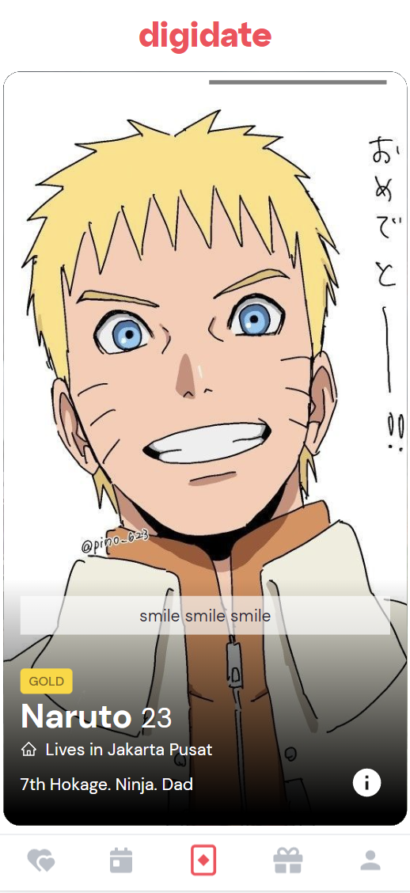
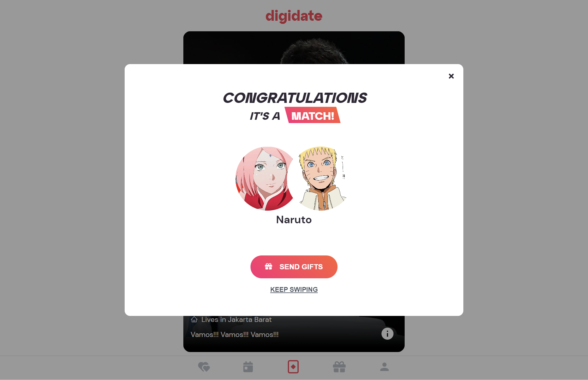
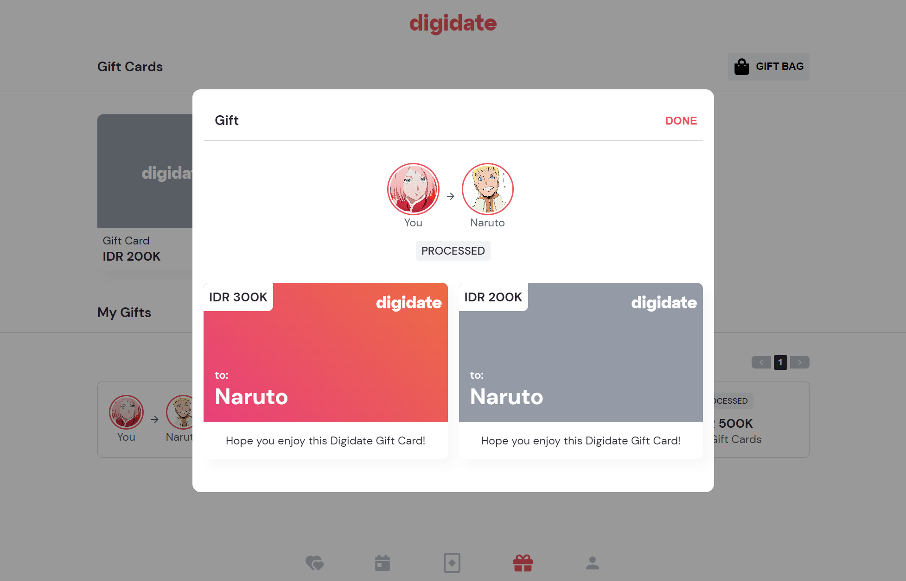
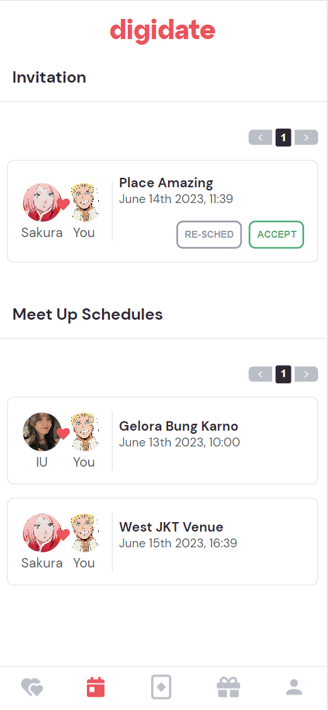
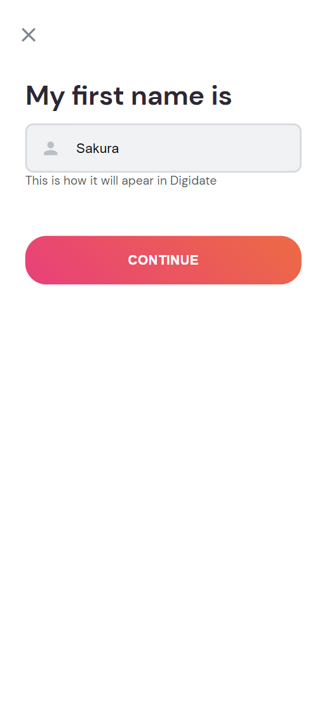
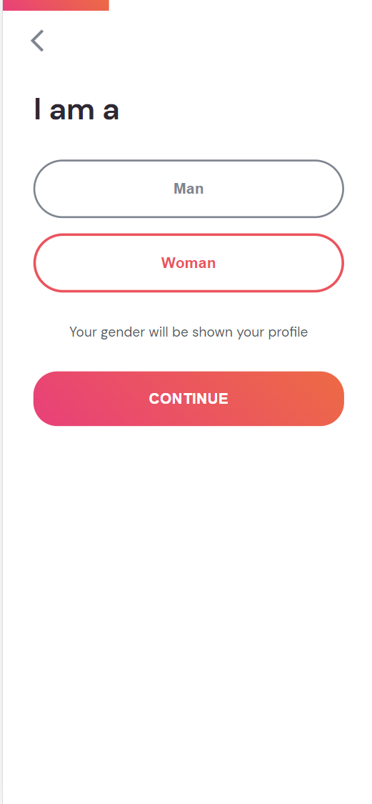
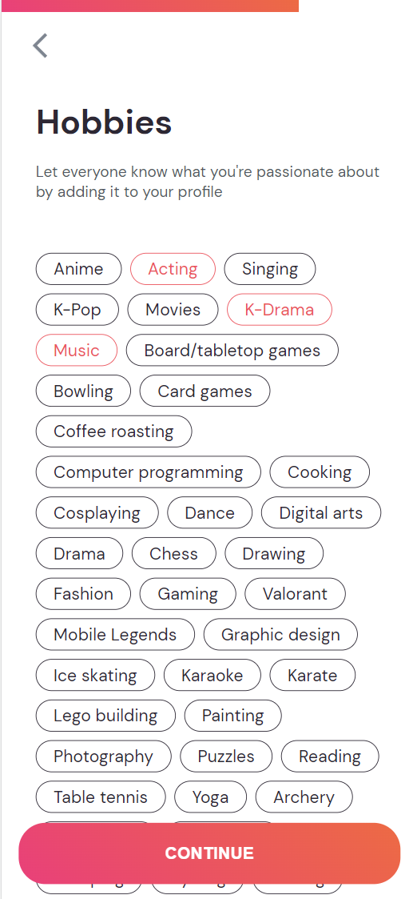
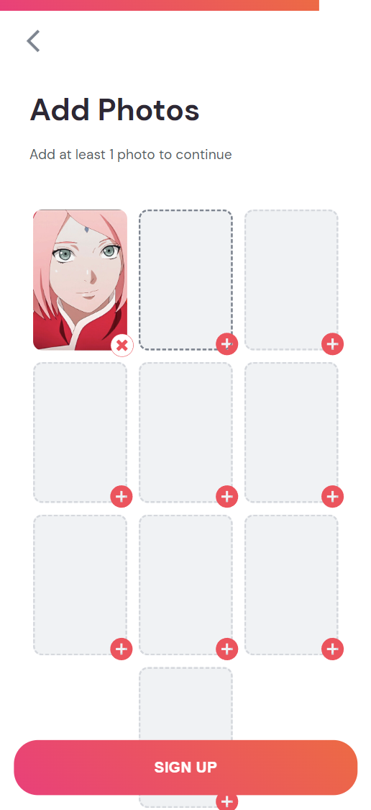
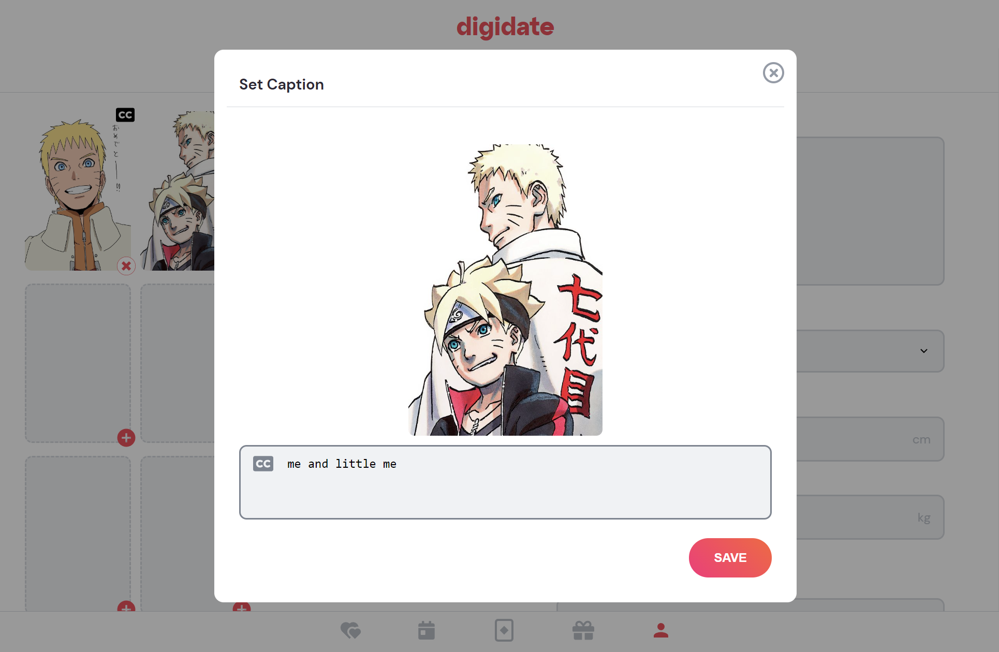
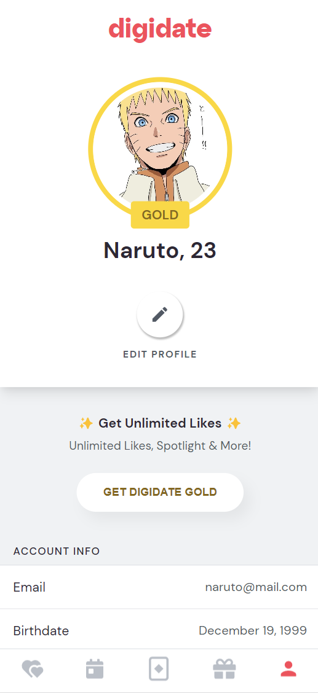

<h1 align="center">
    <a href="https://dating-app-smoky.vercel.app">Digidate</a>
</h1>

  <a href="#introduction"><strong>Introduction</strong></a> ·
  <a href="#features"><strong>Features</strong></a> ·
  <a href="#tech-stack"><strong>Tech Stack</strong></a> ·

 

## Introduction

Digidate is a dating application for users to match, send gifts, and arrange meetup. Built with [React](https://react.dev/), [Redux](https://redux-toolkit.js.org/), [Typescript](https://www.typescriptlang.org/), [Styled-components](https://styled-components.com/) on the frontend, and [Go](https://go.dev/), [GIN](https://gin-gonic.com/), [GORM](https://gorm.io/), [PostgreSQL](https://www.postgresql.org/) on the backend.

## Features

Here are some of the features:

- [Swipe & Match](#swipe-&-match)
- [Gifts](#gifts)
- [Meetup](#meetup)
- [Profile Management](#profile-management)

### Swipe & Match

Swipe right (or right arrow) to like, swipe left (or left arrow) to skip.

Match.

### Gifts

Send and receive gifts to and from your matches.

### Meetup

Arrange a meetup in nearby location with your matches.

### Profile Management

Register.

   

Add photo & caption.

Unlimited likes and Spotlight with DigidateGold Profile.

## Tech Stack

### Frontend

- [React](https://react.dev/) – framework
- [Typescript](https://www.typescriptlang.org/) – language
- [Styled-components](https://styled-components.com/) – styling
- [Redux](https://redux-toolkit.js.org/) – state management
- [Framer motion](https://www.framer.com/motion/) - swipe animation

### Backend

- [Go](https://go.dev/) – language
- [Gin](https://gin-gonic.com/) – http server
- [GORM](https://gorm.io/) – orm
- [PostgreSQL](https://www.postgresql.org/) – database
